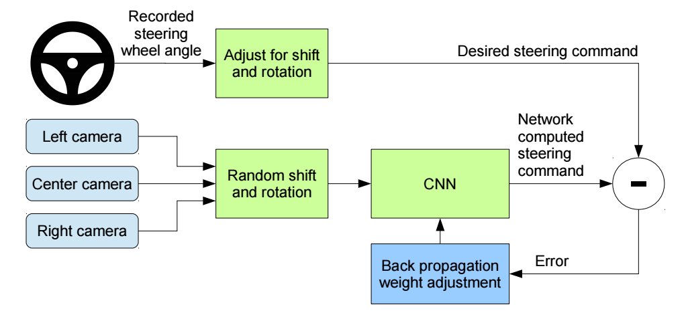
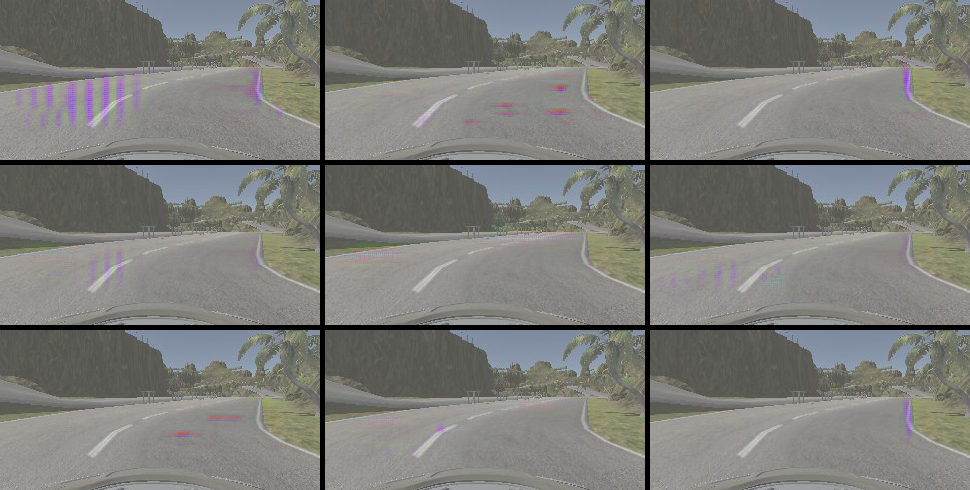

# **Behavioral Cloning**

---

For this project, I trained a convolutional neural network (CNN) to map images captured from a simulated car to steering commands. With training data limited to runs around two tracks recorded in a simulator, the CNN learns to successfully navigate both tracks, which include varying lane markings and lighting conditions, challenging turns and steep inclines.

All training, testing and validation was done on a 2015 MacBook Pro with 16GB of memory, using a standard build of Keras 2.0 to build the model and Tensorflow v1.0.1 as the back end. With this configuration, the system is capable of driving both tracks at a simulated speed of 20 MPH. At 30 MPH, the car tends to veer off the road at points, which I believe is more due to latency (most likely from slowness on the part of my CPU forward propagating an image through the network) than an inherent shortcoming in the CNN's design.

## Model Architecture and Training Strategy

After reading about several approaches taken by other students for this particular project, as well as exploring a few different model options on my own, I chose to focus on the model architecture described in the NVIDIA team's paper, "End to End Learning for Self-Driving Cars"[1]. This model is an appropriate fit for the problem of translating an input image into an output steering radius because it is compact enough to make steering decisions with low latency, but still rich enough to extract enough features to make it robust under varying road conditions. This diagram, taken directly from the above paper, succinctly describes the control flow of how the network is trained.



To train the model, I used images produced by the [driving simulator](https://github.com/udacity/self-driving-car-sim) created by Udacity in the Unity environment, as well as recording 3 laps around the more advanced "Track #2" in the default direction and lap in the opposite direction in order to better generalize the model. The images are recorded from 3 cameras "mounted" left, right and center on the dashboard of a simulated car. These produce 3 different points of view, which will later prove useful for helping the car course correct when it veers too close to the edges of the road. For each recorded frame, a line is added to a CSV file, which includes a path to the three images produced for each frame as well as the steering angle of the car corresponding with that frame. These images are fed into the model, which outputs a predicted steering radius.

### Preprocessing

As my goal was to create an end-to-end learning system with very little interjection of human logic, the preprocessing of the images is minimal. The images fed into the model are first converted to the YUV color space, following the recommendation of the NVIDIA paper. This separates the image into a luma (brightness) component and 2 chrominance (color) components. After applying this preprocessing step, my model faired much better on Track #2, which includes a number of shadows thrown across the road. Prior to applying this change, the vehicle appeared to avoid shadows that partially occluded the road as if they were obstacles and to frequently drive off the road completely when the shadows completely covered the road. I believe separating the image into these color channels allowed the model to better adapt to changes in luminance. I speculate that converting the image to a single grayscale channel would enable similar performance. However, I decided not to discard the color channels for this project as these would theoretically contain valuable information: for example, identifying traffic signals. While not strictly relevant for this project, the added information didn't inhibit the performance of the car. The only other preprocessing step was to add a 50% chance that a given frame would be horizontally flipped, along with multiplying the corresponding steering angle by -1. This helps correct for any leftward or rightward bias that may be included in the training data.

### Model Details

The model is composed of an initial cropping layer, which is used to remove the top 70 and bottom 25 pixels of the image, as these areas contain mostly noise that is irrelevant for learning the steering angles. This also reduces the number of parameters in the model overall. These cropped images are then normalized to a range between -0.5 and 0.5. The image is passed through 3 5x5 convolutional layers with a stride of (2,2). Next, there are 2 3x3 convolutional layers with a stride of (1,1). The last of these layers is flattened and passed to a series of four dense, fully connected layers. The final layer produces a single output, which is the predicted steering angle for the image. This prediction is compared to the recorded steering angle, and the weights in the model are adjusted by computing and back propagating the mean squared error (MSE) of the prediction. The model's learning rate is computed using Adaptive Moment Estimation (Adam), which enables the model to come quickly to convergence by automatically adjusting the learning rates for each parameter over time. The initial learning rate is 0.001. A validation set of 20% the total number of image samples was set aside to calculate the loss for the model, and the model was tested by driving both tracks, forwards and backwards.

```
_________________________________________________________________
Layer       (type)              Output Shape        Param #
=================================================================
cropping2d  (Cropping2D)        (65, 320, 3)        0
_________________________________________________________________
lambda      (Lambda)            (65, 320, 3)        0
_________________________________________________________________
conv2d_1    (Conv2D 5x5)(2x2)   (31, 158, 24)       1824
_________________________________________________________________
conv2d_2    (Conv2D 5x5)(2x2)   (14, 77, 36)        21636
_________________________________________________________________
conv2d_3    (Conv2D 5x5)(2x2)   (5, 37, 48)         43248
_________________________________________________________________
conv2d_4    (Conv2D 3x3)(1x1)   (3, 35, 64)         27712
_________________________________________________________________
conv2d_5    (Conv2D 3x3)(1x1)   (1, 33, 64)         36928
_________________________________________________________________
flatten     (Flatten)           (2112,)             0
_________________________________________________________________
dense_1     (Dense)             (100,)              211300
_________________________________________________________________
dense_2     (Dense)             (50,)               5050
_________________________________________________________________
dense_3     (Dense)             (10,)               510
_________________________________________________________________
dense_4     (Dense)             (1,)                11
=================================================================
Total params: 348,219.0
Trainable params: 348,219.0
Non-trainable params: 0.0
_________________________________________________________________
```

### Generalizing the Model

I experimented with a number of ways to generalize the model. The images fed into the CNN were randomly shuffled so there could be no connection to a particular sequence of images. Recording laps from Track #2 and adding this data to the training data provided by Udacity helped the model perform far better in both scenarios. Also, as mentioned previously, randomly flipping the images horizontally helped negate any bias the human driver may have toward driving on the left or right side of the track. The model seemed to stop improving consistently after about 5 epochs, so I did not train for more than 5 epochs. I attempted to add Dropout layers with to help prevent overfitting, but I was never able to achieve a loss below 13% with these in place. Since I was training on over 42,000 samples and only running the model for 5 epochs, overfitting didn't seem to be a major concern. In fact, while in autonomous mode, I reversed the direction of the car on both tracks to see how well it trained for a scenario different from This was further proved out by the fact that the final model performs well on both tracks, running both in the direction they were trained to run, as well as in the opposite direction.

## Test Runs

### Track 1
[](https://www.youtube.com/watch?v=7UDXKjHU_3s)

### Track 2
[](https://www.youtube.com/watch?v=SvWAL5ckowo)

## Visualizing the Convolutional layers

In an effort to better understand what the network was "seeing", I decided to implement the visualization technique described by Francois Chollet on [the Keras blog](https://blog.keras.io/how-convolutional-neural-networks-see-the-world.html). First, following the article above, I ran a 160x320 matrix initialized with a normally distributed random "gray" noise (`np.random.random((1, 160, 320, 3)) * 20 + 128`) through a given convolutional layer. By running gradient ascent on the input over several iterations, and adding that value back to the image, it's possible to see where in the input space the gradients in a particular filter tend to activate. For example, below are pictured 9 filters with the highest loss from the 4th convolutional layer.


This is interesting, if cryptic. Applying this same operation to an actual image of a driving scene, we start to get a little sense of what is going on.



Examining the images, we see filters that appear to activate on the contours and textures of the road. Still, without more context, it is a bit difficult to see how exactly these are translated into steering commands. It would be interesting to pursue this topic further by running this visualization operation on an entire driving run and recording the output as a video, along with the output steering angle. While beyond the scope of this project, I expect to do a blog post on this exact topic in the near future. The code for running this visualization is included in [viz.py](./viz.py).

---

#### A Note About Using Python Generators

For this project, because of the large number of images and the number of parameters that would need to be held in memory when loading the entire training set, it was suggested that we use Python generators for training. I tried this approach but found it to be drastically slower than simply training the entire set held in memory. The model was trained on a 2015 Macbook Pro with 16GB of memory, not taking advantage of the GPU. Still, using the NVIDIA model, with approximately 42,000 images in the training set and 10,500 images in the validation set, I was able to train at a rate of about 500 seconds per epoch. While running the training operation, my computer did not exceed 15GB of total memory use (~8GB were used by Python). When using the generator approach, the memory usage did improve, but the training time went up to about 5 hours per epoch, so I decided to stick with in-memory training. Nevertheless, the code in model.py does include a flag called `USE_GENERATOR` which, when set to `True` would enable running the images through a generator wrapping the `process_image` function.

## References

[1] M. Bojarski, D. Del Testa, D. Dworakowski, B. Firner, B. Flepp, P. Goyal, L. D. Jackel, M. Monfort, U. Muller, J. Zhang, X. Zhang, J. Zhao, and K. Zieba. End to End Learning for Self-Driving Cars. 	[arXiv:1604.07316](https://arxiv.org/abs/1604.07316) [cs.CV]
